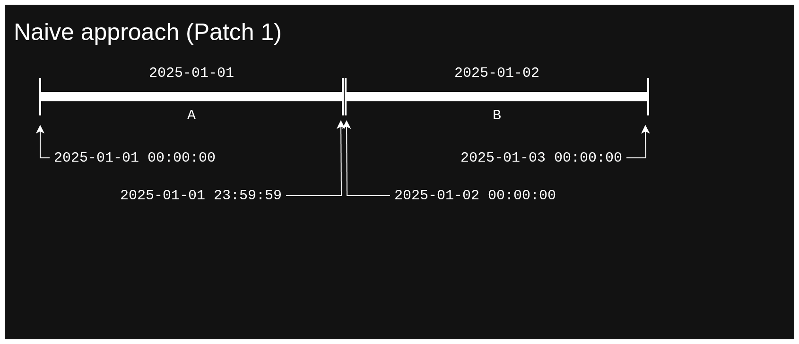
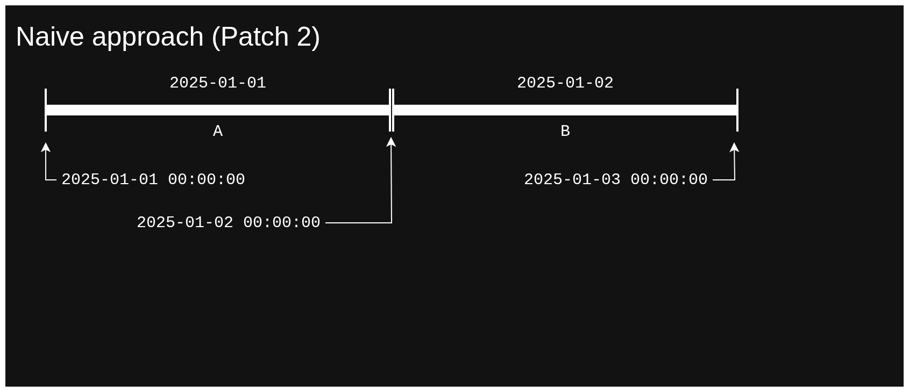
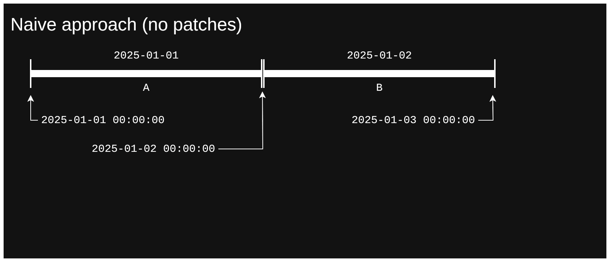
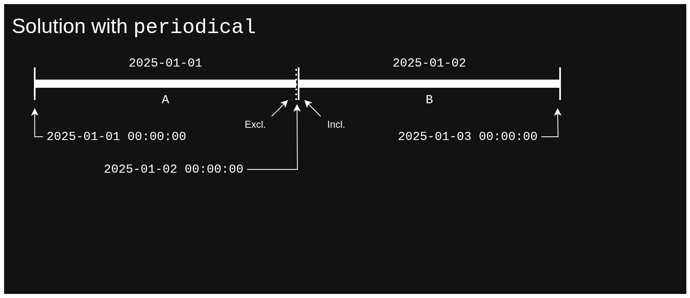

<div align="center">

<h1>🕓 <code>periodical</code> 🕖</h1>

[](https://crates.io/crates/periodical)
[](https://lib.rs/periodical)
[](https://docs.rs/periodical)
[](https://github.com/maeldroem/periodical/actions)

💕 <a href="https://github.com/sponsors/maeldroem"></a> 💕

</div>

`periodical` is a crate to manage absolute and relative time intervals, use it to manage schedules, find overlaps,
and more!

Just add the following in your `Cargo.toml` to start using `periodical` in your project!

```toml
periodical = "0.2"
```

# Why should I use this crate?

Time intervals are a very common need in management software, but it is easily overlooked.
Most people will think that just using times from `chrono` or other time crates will be enough for storing
`from` and `to` datetimes in their database.

Datetimes are not enough! And unfortunately, this is often discovered too late in the development process.

This is what this crate seeks to solve. `periodical` is made to set a uniform standard in how time intervals
are managed, and also provides tools to integrate it within an application that used a simple `from` `to` interval
system.

## Common pitfalls when not using a time interval management crate

### Day problem

The _day problem_ refers to the issue that people will most often encounter when trying to develop a system
to store an interval representing a full day.

A day, as you know, spans from midnight of the day in question up to the next midnight, and it's usually implemented
as `from` containing `2025-01-01 00:00:00Z` and `to` containing `2025-01-02 00:00:00Z`.

However, a day really spans from midnight of the day in question up to the next midnight **excluded**.
This slight difference can lead to different patches being made in your codebase, which can itself cause multiple
standards being implemented depending on the place, leading to confusion.

Common patches are:

1. We subtract a small amount from `to`, usually a single second, so that we end up with `2025-01-01 23:59:59Z`
2. We keep things as-is, and modify the overlap algorithm to support considering adjacent intervals as not overlapping

Patch 1 has the issue that it creates a small duration difference which,
when combined with multiple patched intervals, will end up creating a noticeable duration difference.
For example, if your application manages payroll or has to check for some legal norm, on the scale of a year,
this can lead to pay differences or wrong checks for enforcing the legal norm.

<details>
    <summary>Naive approach - Patch 1 demo (GIF) 📽️</summary>
    
</details>

Patch 2 may therefore seem more practical. However, changing the overlap check itself may impact other overlaps
which need to consider adjacency as an overlap, and can introduce bugs that are triggered by this specific case.

<details>
    <summary>Naive approach - Patch 2 demo (GIF) 📽️</summary>
    
</details>

Also, if you choose to not apply any patches, you will have the issue of `2025-01-02 00:00:00Z` belonging to
two intervals and will still count as being in the first day, when it's clearly not supposed to be the case.

<details>
    <summary>Naive approach demo (GIF) 📽️</summary>
    
</details>

<details>
    <summary>Solution with <code>periodical</code> demo (GIF) 📽️</summary>
    
</details>

# About 📖

⌚ Time intervals are very important in many fields and applications, this is why this crate was made.

It manages time intervals precisely. It takes care of bound inclusivities and supports half-bounded and unbounded
intervals.

🎯 It also provides precise ways to not only check for overlap between two intervals,
but also find what kind of overlap exists!

Since bound inclusivities can introduce ambiguity for what we consider and overlap or containment, the crate provides
many ways to disambiguate those cases in the way way <em>you</em> want.

This allows for treating a day as it really is: From midnight, included, to the next midnight, excluded.
And still receive precise data about its duration and if it's adjacent to another day's interval.

➡️ No more problems with flaky overlap checks and context-dependent durations!

`periodical` also allows you to re-precise an interval to your liking. For example, if you have to keep a timelog
where the bounds have to be rounded to the nearest 45 minutes, you can do it with `periodical`!
It also supports precising bounds individually and with durations that are not divisors of 24 hours 😎.

Most of the things you can think of doing with time intervals, you can do it with `periodical` ✨

And if it doesn't, feel absolutely free to [contribute](CONTRIBUTING.md) or [suggest a change](CONTRIBUTING.md) 😃

# MSRV policy 🦀

The [MSRV, Minimum Supported Rust Version](https://doc.rust-lang.org/cargo/reference/rust-version.html),
of this crate is currently set to Rust `X.Y.Z`, but is subject to change.

Since increasing the MSRV is a breaking change, the version number of this crate will increase in a similar manner
when it is changed, as [SemVer](https://semver.org/) describes it.

# Roadmap 🔜

## 0.2

- [x] [`serde`](https://lib.rs/serde) support 🔢
- [x] Epsilon support for interval durations 🤏
- [ ] Implementation of [`rayon`](https://lib.rs/rayon) for lightning-fast iterators ⚡
- [ ] Added [MSRV](https://doc.rust-lang.org/cargo/reference/rust-version.html)

## Future

(order doesn't represent priority)

- [ ] Convenience methods for creating common intervals with ease 📈
- [ ] Interval periodicity 🔁
- [ ] [Cargo mutants](https://lib.rs/crates/cargo-mutants) 🧪
- [ ] Methods to get overlap/gap durations ↔️
- [ ] Interval formatting (standard and non-standard) ✒️
- [ ] Precision change trait for relative intervals
- [ ] Support for non-UTC timezones 🌐
- [ ] Crate usage examples for practical solutions 🔧
